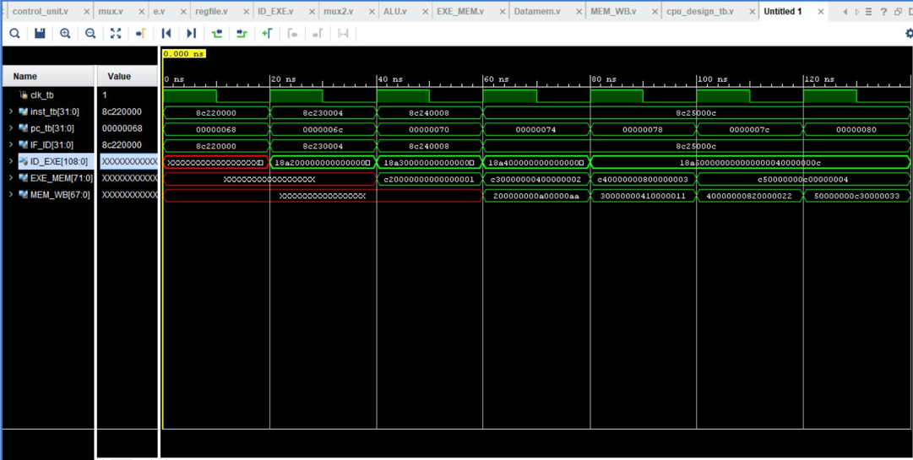

# Five-Stage-Pipelined-CPU

### This is a five-stage pipelined CPU coded in Verilog using the Xilinx design package for FPGAs

The device used was **Device: XC7Z010- -1CLG400C**

#### The following graph shows the structure of the CPU:

The five stages are Instruction Fetch(IF), Instruction Decode(ID), Instruction Execute(EXE), Memory Access(MEM) and Write Back(WB)

#### The following graph shows the waveform:

